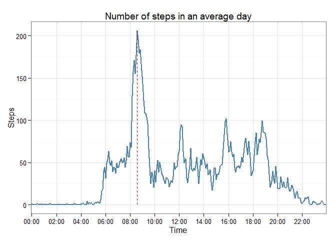
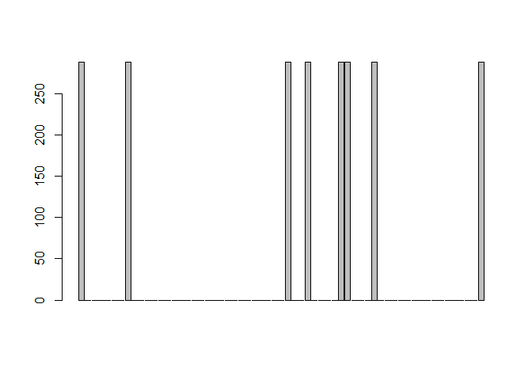
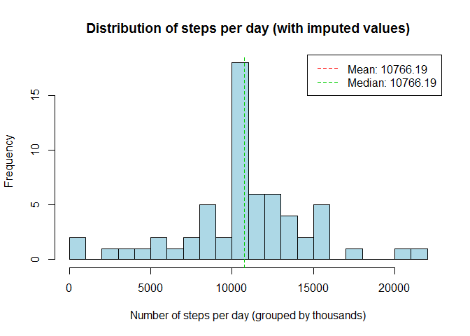

# Reproducible Research: Peer Assessment 1

This document describes the analysis of the data collected over a 2-year period by a fitness tracker. 

## Loading and preprocessing the data

The raw data is loaded into memory.

```r
unzip (zipfile="activity.zip")
activity <- read.csv("activity.csv")
```

The data needs to be properly formatted. For that the *interval* will be converted into a proper time and the *date* in a proper date. 

```r
activity$date <- as.Date(activity$date, "%Y-%m-%d")
militaryTime <- sprintf("%04d", activity$interval)
activity$time <- paste(substr(militaryTime,1,2), substr(militaryTime,3,4),sep=":")
```

## What is mean total number of steps taken per day?
We are going to analyse the distribution of the number of steps that we take every day.

For that purpose we will sum the daily step and observe the distribution every thousand steps.


```r
library(dplyr)
```

```
## Warning: package 'dplyr' was built under R version 3.1.3
```

```
## 
## Attaching package: 'dplyr'
## 
## The following object is masked from 'package:stats':
## 
##     filter
## 
## The following objects are masked from 'package:base':
## 
##     intersect, setdiff, setequal, union
```

```r
daily.steps <- activity %>% 
        group_by(date) %>% 
        summarize (total=sum(steps, na.rm=TRUE))
hist(daily.steps$total, xlab ="Number of steps per day (grouped by thousands)", main ="Distribution of steps per day", col = "lightblue", breaks=seq(0, by=1000, len=23))

# Compute and round the mean
daily.steps.mean <- mean(daily.steps$total)
daily.steps.mean <- round(daily.steps.mean, digits=2)
abline( v = daily.steps.mean, col = 2, lty = 2)

# Compute and round the median
daily.steps.median <- median(daily.steps$total)
daily.steps.median <- round(daily.steps.median, digits=2)
abline( v = daily.steps.median, col = 3, lty = 2)

legend("topright", c(paste("Mean:",daily.steps.mean),paste("Median:",daily.steps.median)) , col = 2:3, lty = 2)
```

 


We can see that there are as many times that the subject walks less than 1000 steps a day, as days when the subject walks between 1000-1100. However the average is **9354.23** steps with a median value of **1.0395\times 10^{4}** steps.

## What is the average daily activity pattern?
To answer this question the data will be averaged per 5-minute interval and displayed, to show what would be an average day.


```r
library(ggplot2)
```

```
## Warning: package 'ggplot2' was built under R version 3.1.3
```

```r
average.day <- activity %>% 
        group_by(time) %>% 
        summarize (mean=mean(steps, na.rm=TRUE))

# Get the max value
max.steps <- average.day[which.max(average.day$mean),] 

ggplot(average.day, aes (x = factor(time), y = mean, group="time")) +
        geom_line(colour="steelblue", size=1) +
        theme_bw() +
        scale_x_discrete(breaks=sprintf("%02d:00",seq(00,24, by=2))) + 
        ggtitle("Number of steps in an average day") + xlab("Time") + ylab("Steps") +
        geom_segment(colour="red", lty= 2, aes(x = max.steps$time, y = 0, xend = max.steps$time, yend = max.steps$mean))
```

 

In an average day a maximum number of **206.17** steps were taken at **08:35**

## Imputing missing values
We are going to have a look at the amount of missing values (NA). And we are going to see how much impact they have in our data. For that we will have a look at how are they distributed.

Firstly let´s compute the total NA values.

```r
missing.values.total <- sum(is.na(activity$steps))
missing.values.percentage <- round (missing.values.total / nrow(activity) * 100, digits = 2)
```


```r
missing.values.per.day <- activity %>%
        group_by(date) %>%
        summarize(sum=sum(is.na(steps)))

days.missing.values <- sum(missing.values.per.day$sum != 0)

barplot(missing.values.per.day$sum)
```

 

There is a total of just 8 days missing information. 

As we can see the dates where values are missing, they are missing for the whole day. 13.11% is of total the data is missing. 

The approach to impute the missing values will be to replace them with the average day information.


```r
activity2 <- activity

# Create a function to fill the NAs with the average date
# The values need to be converted from int to numeric to keep the decimals
fillNA <- function(x) 
        {
                if (is.na(x[1])) 
                {
                        x.time <- x[4]
                        idx <- which(average.day[1] == x.time)
                        avg.row <- average.day[idx,]
                        as.numeric(avg.row[2])
                }
                else
                {
                        as.numeric(x[1])
                }
        }

activity2$steps <- apply(activity2, 1, fillNA)

#rows.activity.NA <- which(is.na(activity$steps))
#times.rowsNA <- activity2[rows.activity.NA,]$time
#rows.average.day <- which(average.day$time == times.rowsNA)

#activity2[rows.activity.NA,]$steps <- average.day[rows.average.day,]$mean
```

Let´s observe the difference between the original data and the data with imputed values.


```r
daily2.steps <- activity2 %>% 
        group_by(date) %>% 
        summarize (total=sum(steps, na.rm=TRUE))
hist(daily2.steps$total, xlab ="Number of steps per day (grouped by thousands)", main ="Distribution of steps per day (with imputed values)", col = "lightblue", breaks=seq(0, by=1000, len=23))

# Compute and round the mean
daily2.steps.mean <- mean(daily2.steps$total)
daily2.steps.mean <- round(daily2.steps.mean, digits=2)
abline( v = daily2.steps.mean, col = 2, lty = 2)

# Compute and round the median
daily2.steps.median <- median(daily2.steps$total)
daily2.steps.median <- round(daily2.steps.median, digits=2)
abline( v = daily2.steps.median, col = 3, lty = 2)

legend("topright", c(paste("Mean:",daily2.steps.mean),paste("Median:",daily2.steps.median)) , col = 2:3, lty = 2)
```

 

## Are there differences in activity patterns between weekdays and weekends?
